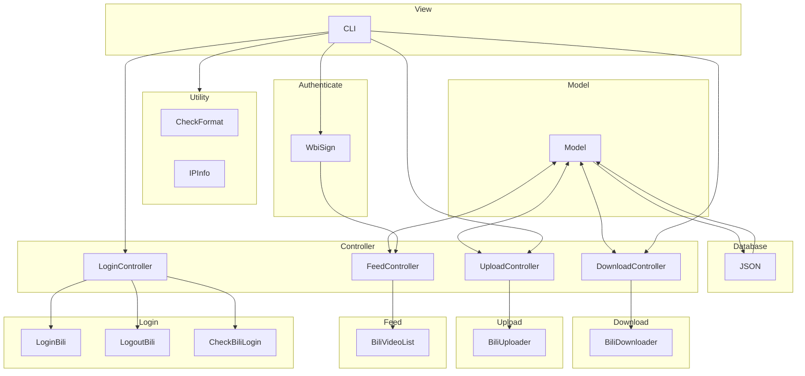

<div align="center">
  <picture>
    <source media="(prefers-color-scheme: dark)" srcset="assets/headerDark.svg" />
    
  </picture>
  <p> </p>

[简体中文](./README.md) | English

</div>

> Welcome to use, provide feedback, and contribute to this project via PRs. Please do not use it for purposes that violate community guidelines.

`bilitool` is a Python toolkit that provides features such as persistent login, video download, and video upload to Bilibili. It can be used via command-line interface (CLI) or as a library in other projects.

The project is designed following the MVC architecture:



## Major Features

- `bilitool login` remembers and stores login status
  - Supports exporting `cookies.json` for use in other projects
- `bilitool logout` logs out
  - Logs out and clears cookies to protect privacy and prevent leaks
- `bilitool check` checks login status
- `bilitool upload` uploads videos
  - Supports various custom parameters for uploading
  - Supports uploading videos with YAML configuration and parsing
  - Displays logs and upload progress
  - Supports **automatic speed test and selection of the best route** (default)
  - Supports specifying upload lines (`qn`, `bldsa`, `ws`, `bda2`, `tx`)
  - Supports uploading cover image
- `bilitool append` appends videos to existing videos (multi-part)
- `bilitool download` downloads videos
  - Supports downloading with `bvid` and `avid` identifiers
  - Supports downloading danmaku (comments)
  - Supports downloading in multiple qualities
  - Supports downloading multi-part videos
  - Displays logs and download progress
- `bilitool list` queries the status of past uploaded videos
  - Supports querying videos with various statuses
  - Displays reasons if video review fails
- `bilitool convert` converts video identifiers
  - Supports conversion between `bvid` and `avid`
- `bilitool show` displays detailed video information
  - Supports viewing basic video information and interaction data
- `bilitool ip` displays IP information
  - Supports querying specified IP addresses
- Append videos to existing videos (planned support)

> Add `-h` or `--help` to the above commands to view command help information.
> 
> For more detailed commands, refer to the [project documentation](https://bilitool.timerring.com).

## Installation

> Recommended Python version >= 3.10.

```bash
pip install bilitool
```

Alternatively, you can download the compiled CLI tool and run it directly [Download Link](https://github.com/timerring/bilitool/releases).

## Usage

### CLI Method

> For more detailed commands, refer to the [project documentation](https://bilitool.timerring.com).

Help information:

```
usage: bilitool [-h] [-V] {login,logout,upload,check,download,list,ip} ...

The Python toolkit package and cli designed for interaction with Bilibili

positional arguments:
  {login,logout,upload,append,check,download,list,show,convert,ip}
                        Subcommands
    login               Login and save the cookie
    logout              Logout the current account
    upload              Upload the video
    append              Append the video
    check               Check if the user is logged in
    download            Download the video
    list                Get the uploaded video list
    show                Show the video detailed info
    convert             Convert between avid and bvid
    ip                  Get the ip info

options:
  -h, --help            show this help message and exit
  -V, --version         Print version information
```

### API Method

> For more detailed functions and documentation, refer to the [project documentation](https://bilitool.timerring.com).

```python
from bilitool import LoginController, UploadController, DownloadController, FeedController, IPInfo, CheckFormat

# Login
LoginController().login_bilibili(export: bool)
# Logout
LoginController().logout_bilibili()
# Check login
LoginController().check_bilibili_login()

# Upload
UploadController().upload_video_entry(video_path: str, yaml: str, line: str, copyright: int, tid: int, title: str, desc: str, tag: str, source: str, cover: str, dynamic: str, cdn: str)

# Append
UploadController().append_video_entry(video_path: str, bvid: str, cdn: str)

# Download
DownloadController().download_video_entry(vid: str, danmaku: bool, quality: int, chunksize: int, multiple: bool)

# Query recent video list
FeedController().print_video_list_info(size: int, status: str)

# Query video information
FeedController().print_video_info(vid: str)

# Convert video identifier
CheckFormat().convert_bv_and_av(vid: str)

# Query IP information
IPInfo.get_ip_address(ip: str)
```

## Acknowledgments

- Thanks to [bilibili-API-collect](https://github.com/SocialSisterYi/bilibili-API-collect) for providing the API collection.