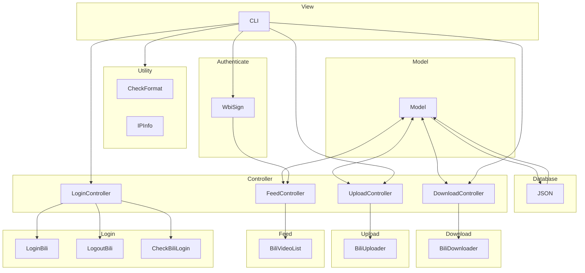

<div align="center">
  <picture>
    <source media="(prefers-color-scheme: dark)" srcset="assets/headerDark.svg" />
    
  </picture>
  <p> </p>

简体中文 | [English](./README-en.md)

</div>

> 欢迎使用，欢迎提供更多反馈，欢迎 PR 贡献此项目，请勿用于违反社区规定的用途。

`bilitool` 是一个 python 的工具库，实现持久化登录，下载视频，上传视频到 bilibili 等功能，可以使用命令行 cli 操作，也可以作为其他项目的库使用。

项目仿照 MVC 架构进行设计：



## Major features

- `bilitool login` **记忆存储登录状态**
  - 支持导出 `cookies.json` 用于其他项目
- `bilitool logout` 退出登录
  - 退出登录同时注销 cookies，**保护隐私防止泄露**
- `bilitool check` 检查登录状态
- `bilitool upload` 上传视频
  - 支持多种自定义参数上传
  - 支持上传视频的 yaml 配置与解析
  - 显示日志与上传进度
  - 支持**自动测速并且选择最佳线路**(默认)
  - 支持指定上传线路(`qn`, `bldsa`, `ws`, `bda2`, `tx`)
  - 支持上传视频封面图片
- `bilitool append` 追加视频到已有的视频(**分p投稿**)
- `bilitool download` 下载视频
  - 支持 `bvid` 和 `avid` 两种编号下载
  - 支持下载弹幕
  - 支持下载多种画质
  - **支持下载多 p 视频**
  - 显示日志与下载进度
- `bilitool list` **查询本账号过往投稿视频状态**
  - 支持查询多种状态的视频
  - 若视频审核未通过，同时会显示原因
- `bilitool convert` 查询转换视频编号
  - 支持 `bvid` 和 `avid` 两种编号互转
- `bilitool show` 显示视频详细信息
  - 支持查看视频基本信息以及互动状态数据
- `bilitool ip` **显示请求 IP 地址**
  - 支持查询指定 IP 地址

> 以上命令添加 `-h` 或 `--help` 参数可以查看命令帮助信息。
> 
> 更详细的命令可以参考[项目文档](https://bilitool.timerring.com)。

## Installation

> 推荐 Python 版本 >= 3.10.

```bash
pip install bilitool
```

或者你也可以下载编译好的 cli 工具直接运行 [下载地址](https://github.com/timerring/bilitool/releases)。

## Usage

### cli 方式

> 更详细的命令可以参考[项目文档](https://bilitool.timerring.com)，这里不赘述。

帮助信息：

```
usage: bilitool [-h] [-V] {login,logout,upload,check,download,list,ip} ...

The Python toolkit package and cli designed for interaction with Bilibili

positional arguments:
  {login,logout,upload,append,check,download,list,show,convert,ip}
                        Subcommands
    login               Login and save the cookie
    logout              Logout the current account
    upload              Upload the video
    append              Append the video
    check               Check if the user is logged in
    download            Download the video
    list                Get the uploaded video list
    show                Show the video detailed info
    convert             Convert between avid and bvid
    ip                  Get the ip info

options:
  -h, --help            show this help message and exit
  -V, --version         Print version information
```

### 接口调用方式

> 更详细的函数及文档可以参考[项目文档](https://bilitool.timerring.com)。

```python
from bilitool import LoginController, UploadController, DownloadController, FeedController, IPInfo, CheckFormat

# 登录
LoginController().login_bilibili(export: bool)
# 退出登录
LoginController().logout_bilibili()
# 检查登录
LoginController().check_bilibili_login()

# 上传
UploadController().upload_video_entry(video_path: str, yaml: str, copyright: int, tid: int, title: str, desc: str, tag: str, source: str, cover: str, dynamic: str, cdn: str)

# 追加投稿（分p）
UploadController().append_video_entry(video_path: str, bvid: str, cdn: str)

# 下载
DownloadController().download_video_entry(vid: str, danmaku: bool, quality: int, chunksize: int, multiple: bool)

# 查询近期投稿列表
FeedController().print_video_list_info(size: int, status: str)

# 查询视频信息
FeedController().print_video_info(vid: str)

# 查询视频编号
CheckFormat().convert_bv_and_av(vid: str)

# 查询 IP 信息
IPInfo.get_ip_address(ip: str)
```

## Acknowledgments

- 感谢 [bilibili-API-collect](https://github.com/SocialSisterYi/bilibili-API-collect) 提供的 API 集合。