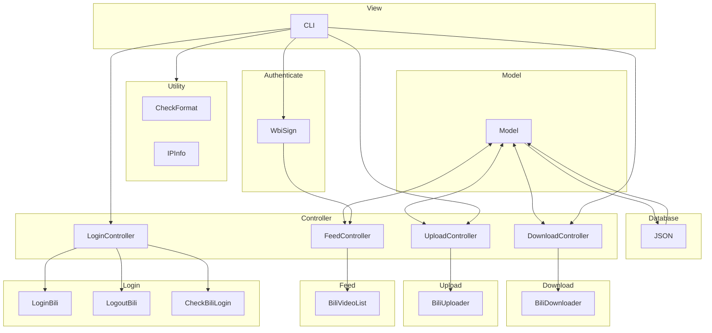

# Introduction

`bilitool` 是一个 python 的工具库，实现持久化登录，下载视频，上传视频到 bilibili 等功能，可以使用命令行 cli 操作，也可以作为其他项目的库使用。

## Major features

- `login` 记忆存储登录状态
  - 支持导出 `cookies.json` 用于其他项目
- `logout` 退出登录
- `check` 检查登录状态
- `upload` 上传视频
  - 支持多种自定义参数上传
  - 支持上传视频的 yaml 配置与解析
  - 显示日志与上传进度
- `download` 下载视频
  - 支持 `bvid` 和 `avid` 两种编号下载
  - 支持下载弹幕
  - 支持下载多种画质
  - 支持下载多 p 视频
  - 显示日志与下载进度
- `ip` 显示请求 IP 地址
  - 支持查询指定 IP 地址
- `list` 查询本账号过往投稿视频状态
  - 支持查询多种状态的视频
  - 若视频审核未通过，同时会显示原因
- `convert` 查询转换视频编号
  - 支持 `bvid` 和 `avid` 两种编号互转
- `show` 显示视频详细信息
  - 支持查看视频基本信息以及互动状态数据
- 追加视频到已有的视频（预计支持）

## Architecture diagram

项目仿照 MVC 架构进行设计：

